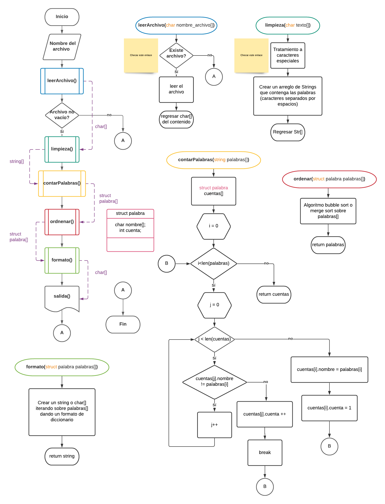

# Creación de Diccionario para aplicación de word2vec

Práctica 1
### Pre-requerimientos ⚙️
- **Marco teórico**: Investigar los siguientes conceptos:
    - Natural Language Processing (NLP)
    - Redes Neuronales
    - Word Embeddings
    - word2vec
- **Diagrama**: Entregar en forma de diagrama de bloques o pseudocódigo el algoritmo que se diseñó para generar el programa.

### Requerimientos 📋
El código debe ser de tipo .c o .cpp. El código debe estar **tabulado y comentado**.
El programa debe ser capaz de:
- Leer un archivo de texto
- Contar la cantidad de veces que aparece cada palabra
- Escribir en otro archivo diccionario de todas las palabras ordenadas de mayor frecuencia a menor frecuencia.

#### Pruebas 🛠️
- Incluir una retroalimentación de 3 compañeros ajenos al equipo

#### Conclusiones 📖
- Describir individualmente el aprendizaje, los retos y las observaciones de la práctica.
- Describir también los riesgos y problemas que un sistema de este tipo puede generar al
ser implementado en el mundo real.

#### Evaluación ✅ 

| Métrica      | Valor |
| ----------- | ----------- |
| Marco Teórico      | 5%       |
| Diseño de Algoritmo   | 20%        |
| Programa   | 50%        |
| Pruebas   | 20%        |
| Conclusiones   | 5%        |

#### Entrega 💻
Fecha de entrega: **13 de septiembre de 2021**
Enviar el reporte en formato .doc y el archivo con el código en formato .c o .cpp a pablozetinag@gmail.com para revisión.

#### Puntos Extra ➕
Se otorgará un 10% extra al equipo que en su reporte incluya también un resumen
del paper “Distributed Representations of Words and Phrases and their Compositionality” de Mikolov, et. al., adjunto en el material de la práctica.
